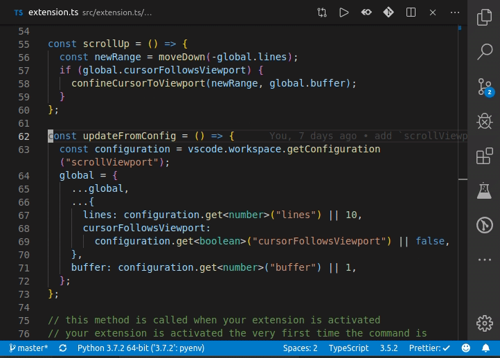

# 📜🖥 Scroll Viewport

[](https://marketplace.visualstudio.com/items?itemName=bmalehorn.scroll-viewport)
[](https://marketplace.visualstudio.com/items?itemName=bmalehorn.scroll-viewport)



When you scroll with the mouse, it moves the viewport up and down without moving the cursor.

Scroll Viewport adds keybindings for that behavior:

| keybinding               | command     |
| ------------------------ | ----------- |
| `Ctrl+Down` / `Cmd+Down` | scroll down |
| `Ctrl+Up` / `Cmd+Up`     | scroll up   |

## Extension Settings

| name                   | default | effect                             |
| ---------------------- | ------- | ---------------------------------- |
| `scrollViewport.lines` | `10`    | How many lines to scroll up / down |

## `editorScroll`

VSCode already has a similar [built-in command](https://code.visualstudio.com/api/references/commands) called `editorScroll`:

```json
[
  {
    "key": "ctrl+down",
    "command": "editorScroll",
    "when": "textInputFocus",
    "args": {
      "to": "down",
      "by": "line",
      "revealCursor": true,
      "value": 10
    }
  },

  {
    "key": "ctrl+up",
    "command": "editorScroll",
    "when": "textInputFocus",
    "args": {
      "to": "up",
      "by": "line",
      "revealCursor": true,
      "value": 10
    }
  }
]
```

ScrollViewport exists to address a few `editorScroll` problems:

1. `editorScroll` gets stuck if you use **code folding**
2. `editorScroll` won't preserve & expand your **selection**

## Similar Projects

- [keyboard-scroll](https://github.com/finalclass/vscode-keyboard-scroll)
- [scrollkey](https://github.com/74th/vscode-scrollkey)
- [scrolloff](https://github.com/TickleForce/vscode-scrolloff)
